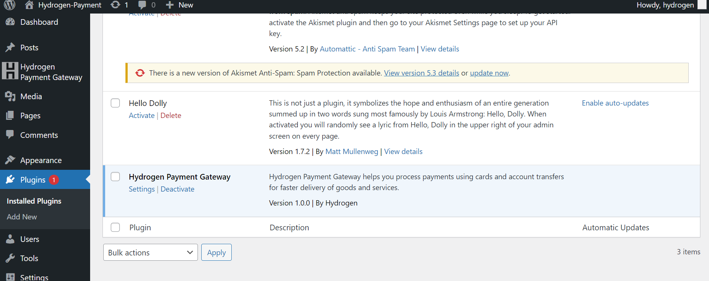
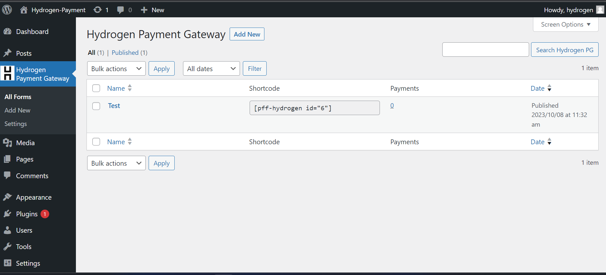
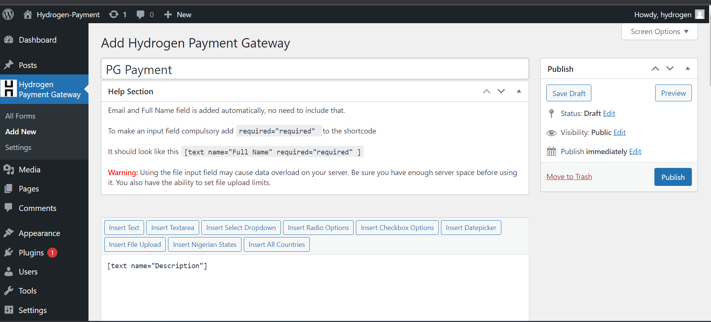
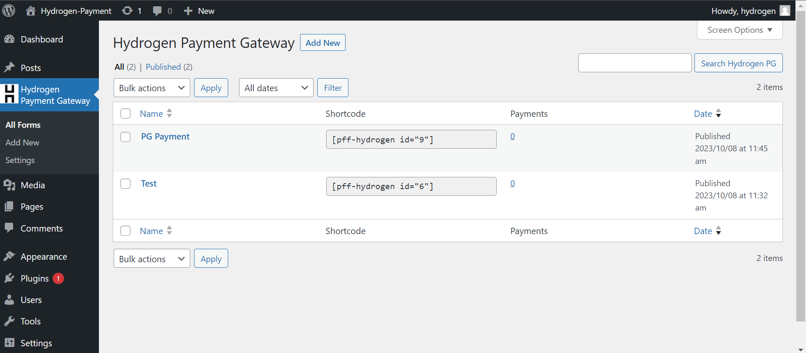
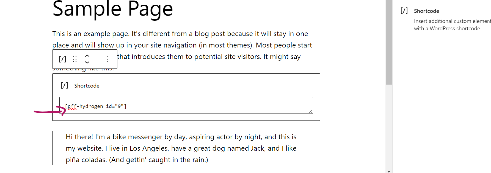
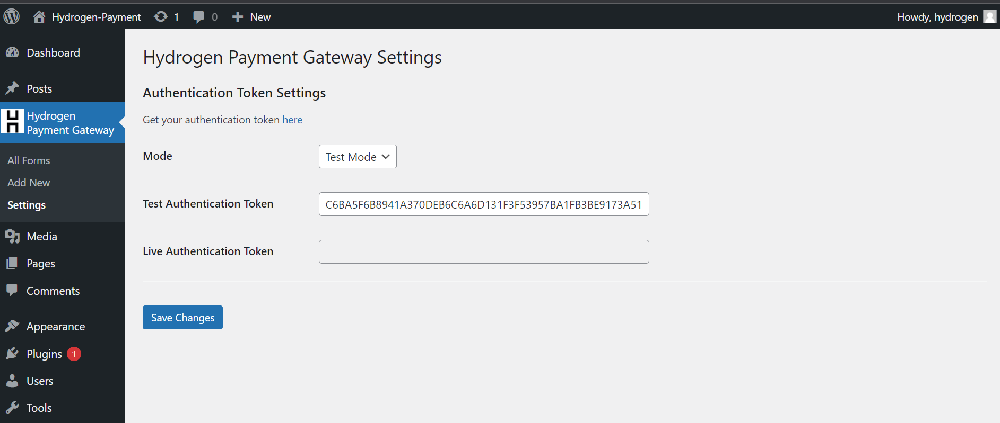
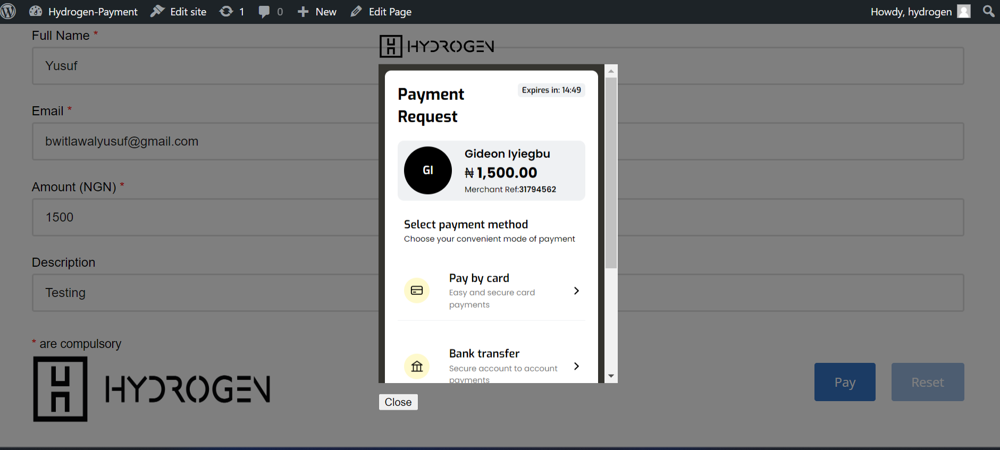

# Hydrogen Payment Gateway

Contributors: hydrogen, hydrogenpay

Tags: payment, gateway, hydrogen, hydrogenpay, nigeria, mastercard, visa, cards, naira, dollar, verve, donation, form, contact from 7

Donate link: https://hydrogenpay.com/

Requires at least: 4.0

Tested up to: 5.9

Stable tag: 1.0.0

License: GPL-2.0-or-later

License URI: https://www.gnu.org/licenses/gpl-2.0.html

Hydrogen Payment Gateway helps you process payments using cards and account transfers for faster delivery of goods and services.

# Description 

The purpose of this scope document is to outline the specific scope of work for the development of plugins to integrate Payment Gateway API into a merchant’s website or product. 

Develop WordPress/Shopify plugins to seamlessly integrate Hydrogen’s Payment Gateway APIs into the merchant’s product.

Hydrogen Payment Gateway helps you process payments using cards and account transfers for faster delivery of goods and services.

# Getting Started

1.	Installation process:

    * Install the Hydrogen Payment Gateway Forms for Hydrogen via the Plugins section of your WordPress Dashboard.

    

    

    

    

    

2.	Software dependencies

3.	Latest releases

    * 1.0.0

4.	API references

    * https://dashboard.hydrogenpay.com/

    * https://docs.hydrogenpay.com/docs/authentication

# Build and Test
TODO: Describe and show how to build your code and run the tests.

# Contribute

If you discover a bug or have a solution to improve the Hydrogen Payment Gateway for Hydrogen plugin,
we welcome your contributions to enhance the code.

 * Visit our GitHub repository: [https://dev.azure.com/HydrogenPay/Payment%20Gateway/_git/be_pg_plugin]

 * Create a detailed bug report or feature request in the "Issues" section.

 * If you have a code improvement or bug fix, feel free to submit a pull request.

        * Fork the repository on GitHub

        * Clone the repository into your local system and create a branch that describes what you are working on by pre-fixing with feature-name.

        * Make the changes to your forked repository's branch. Ensure you are using PHP Coding Standards (PHPCS).

        * Make commits that are descriptive and breaks down the process for better understanding.

        * Push your fix to the remote version of your branch and create a PR that aims to merge that branch into master.
        
        * After you follow the step above, the next stage will be waiting on us to merge your Pull Request.

 Your contributions help us make the PG plugin even better for the community. Thank you!

If you want to learn more about creating good readme files then refer the following [guidelines](https://docs.microsoft.com/en-us/azure/devops/repos/git/create-a-readme?view=azure-devops). You can also seek inspiration from the below readme files:
- [ASP.NET Core](https://github.com/aspnet/Home)
- [Visual Studio Code](https://github.com/Microsoft/vscode)
- [Chakra Core](https://github.com/Microsoft/ChakraCore)